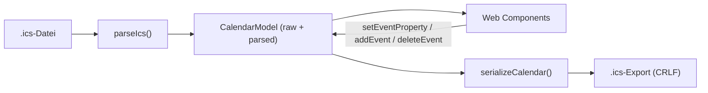
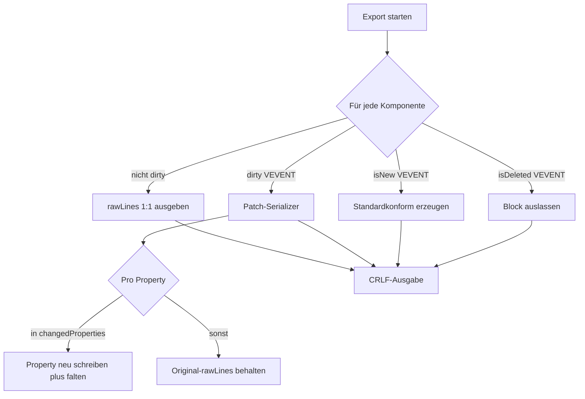

# Architektur

## Leitprinzip: Raw + Patch

Kein vollständiger Roundtrip durch eine Kalenderbibliothek. Jede Komponente wird
**doppelt** gehalten:

- als `rawLines` (unangetastete Originalzeilen), und
- als `parsed` (interpretierte, editierbare Sicht).

Beim Export gilt: **unverändert = Originalzeilen ausgeben; geändert = nur betroffene
Properties patchen**. ICAL.js wird höchstens als optionale Rechenhilfe
(RRULE-Expansion, Zeitzonen) genutzt, nie als Exportweg.

### Warum nicht der klassische Roundtrip?

Ein voller Weg `ICS -> Bibliotheksmodell -> Neuerzeugung` kann verändern oder
entfernen: unbekannte `X-*`-Properties, Property-Reihenfolge, Parameter, HTML in
`X-ALT-DESC`, mehrere `VALARM`-Blöcke, spezielle `VTIMEZONE`-Informationen sowie
Formatierung/Folding.

## Datenmodell

Definiert in `src/model/types.ts`.

```ts
interface ContentLine {
  name: string;
  parameters: Record<string, string[]>;
  parameterOrder: string[];   // erhält die ursprüngliche Parameterreihenfolge
  value: string;
  rawLines: string[];         // ursprüngliche physische Zeilen (inkl. Folding)
}

interface Component {
  kind: string;               // VCALENDAR | VEVENT | VALARM | VTIMEZONE | ...
  rawLines: string[];         // exakte Originalzeilen inkl. BEGIN/END
  properties: ContentLine[];
  children: Component[];
  dirty: boolean;             // false => rawLines 1:1 ausgeben
}

interface VEvent {
  component: Component;        // Rohzugriff (Source of Truth für den Export)
  parsed: ParsedEvent;        // interpretierte Sicht für die UI
  changedProperties: Set<string>;
  isNew: boolean;
  isDeleted: boolean;
}
```

Der `CalendarModel` (`src/model/types.ts`) hält den `VCALENDAR`-Baum, einen Index
der editierbaren Events sowie die beim Import erkannte Zeilenendung
(`originalEol`) und ob die Datei mit einem Zeilenumbruch endete.

Die Invariante, die den Editor verlustarm macht: **Ist eine Komponente nicht
`dirty`, wird sie aus `rawLines` unverändert serialisiert.**

## Datenfluss



## Exportstrategie (Herzstück der Verlustarmut)

Implementiert in `src/export/patch.ts`.



Reihenfolge unveränderter Properties bleibt erhalten; nur geänderte Properties
werden an ihrer bisherigen Position ersetzt, neue ans Ende der Komponente
angehängt.

## Verhalten bei Terminen

Siehe `src/model/calendar.ts`.

- **Bestehend:** UID unverändert; DTSTAMP nach Regel; LAST-MODIFIED aktualisierbar;
  SEQUENCE erhöhbar; unbearbeitete/unbekannte Properties und Alarme bleiben.
- **Neu:** `UID:<uuid>@ics-editor.local` (Suffix konfigurierbar über
  `DEFAULT_UID_SUFFIX`), Mindestfelder UID/DTSTAMP/DTSTART/DTEND|DURATION/SUMMARY.
- **Gelöscht:** kompletter `VEVENT`-Block entfernt, sonst nichts.

## Technischer Stack

- TypeScript, Vite (Build + Dev-Server), Vitest (Tests)
- UI mit nativen Web Components (Custom Elements), kein Framework
- CSS ohne Präprozessor
- File System Access API mit `FileReader`-Fallback; Download via Blob
- Ziel-Hosting: GitHub Pages (statisch, `base` in `vite.config.ts`)

Weiter zu [Parser](Parser.md).
