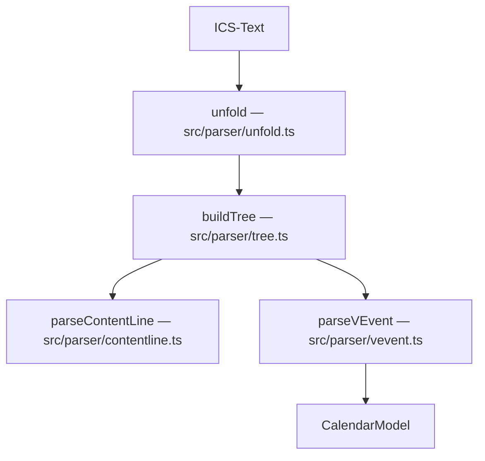

# Parser

Der Parser wandelt einen ICS-Text in ein `CalendarModel` um und erhält dabei
alle Rohdaten. Einstieg: `parseIcs()` in `src/parser/index.ts`.

## 1. Zeilenumbrüche und Unfolding — `src/parser/unfold.ts`

- **Import akzeptiert** CRLF, LF und lone CR. Die dominante Zeilenendung wird
  erkannt (`eol`) und beim Export wieder verwendet (Standard CRLF).
- **Unfolding:** Eine physische Zeile, die mit Space oder Tab beginnt, ist eine
  Fortsetzung der vorherigen logischen Zeile; genau **ein** führendes Zeichen wird
  entfernt (RFC 5545).
- **Wichtig für Verlustarmut:** Zusätzlich zu den logischen Zeilen bleiben die
  physischen Zeilen erhalten. Jede logische Zeile merkt sich über
  `physicalIndices`, aus welchen physischen Zeilen sie entstanden ist.

## 2. ContentLine-Split — `src/parser/contentline.ts`

Eine Property hat die Form `NAME;PARAM=WERT:PROPERTY-WERT`. Es wird nicht naiv an
`;` oder `:` gesplittet, da Parameterwerte gequotet sein und diese Zeichen
enthalten können. Stattdessen läuft eine kleine Zustandsmaschine (Name -> Parameter
mit gequoteten/mehrwertigen Werten -> Wert). Getestet in `test/parser.test.ts`.

## 3. Komponentenbaum — `src/parser/tree.ts`

`BEGIN:X` / `END:X` erzeugen Komponenten. Jede Komponente speichert ihre exakten
Originalzeilen (inkl. BEGIN/END und Faltung). Unbekannte Komponenten (z. B.
`VTODO`, `VJOURNAL`, `VFREEBUSY`) werden als generische `Component` erhalten.

## 4. VEVENT-Interpretation — `src/parser/vevent.ts`

`parseVEvent()` liest die bekannten Properties in die `parsed`-Sicht, ohne etwas
zu mutieren oder zu verwerfen. Alle übrigen Properties bleiben über
`component.properties` / `component.rawLines` zugänglich. Datums-/Zeitwerte werden
als `DateTimeValue` (`raw`, `isDate`, `isUtc`, `tzid`) interpretiert.

Weiter zu [Export & Validation](Export-and-Validation.md).
