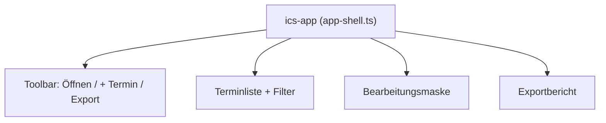

# UI

Die Oberfläche ist framework-frei mit nativen Web Components umgesetzt. Aktuell
liegt die gesamte MVP-Interaktivität in einer Komponente `ics-app`
(`src/ui/app-shell.ts`), registriert über `src/main.ts`. Styles in
`src/styles/app.css` (inkl. Dark-Mode über `prefers-color-scheme`).

## Aufbau

## Terminliste

Zeigt Datum/Zeit, Titel, Wiederholungs- (↻) und Alarm-Symbol (⏰) sowie einen
Änderungsindikator. Filter: Suche (Titel/Ort), nur geänderte, nur Serien, nur
Termine mit Alarm.

## Bearbeitungsmaske

Standardfelder: SUMMARY, DTSTART, DTEND, LOCATION, DESCRIPTION. Erweiterte Bereiche
(aufklappbar): RRULE (roh) und EXDATE sowie eine Rohdaten-Ansicht aller Properties.
Die UID wird **schreibgeschützt** angezeigt.

Änderungen laufen über `setEventProperty()` (`src/model/calendar.ts`), das die
betroffene Property in `changedProperties` markiert und die Komponente `dirty`
setzt — Basis für den selektiven Patch-Export.

## Neu / Löschen

`+ Termin` erzeugt über `addEvent()` einen standardkonformen `VEVENT` mit neuer UID
(`@ics-editor.local`). Löschen markiert den Termin (`deleteEvent()`); beim Export
verschwindet nur dessen Block.

## Export

Vor dem Download wird `validate()` ausgeführt; bei Fehlern erfolgt eine Rückfrage.
Danach `serializeCalendar()` -> Blob-Download, anschließend Anzeige des Berichts aus
`buildReport()`.

## Ausblick

Die im Plan skizzierten Einzelkomponenten (`event-list`, `event-editor`,
`rrule-editor`, `export-report`) können bei wachsender Komplexität aus `app-shell`
herausgelöst werden. Siehe [Roadmap](Roadmap.md).

Weiter zu [Testing](Testing.md).
